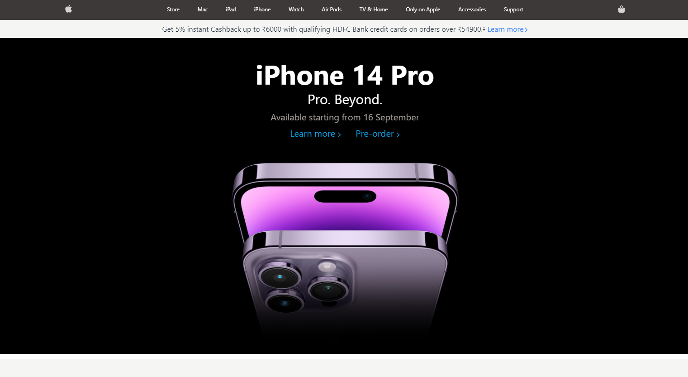

Link:- https://apple-website-clone.onrender.com/

A clone of Apple's homepage of their [official website](https://www.apple.com/in/) (location: India) by implementing the big block design.

## Tech used

- [ReactJS](https://reactjs.org/)
- [Tailwind CSS](https://tailwindcss.com/)
- [daisyUI](https://daisyui.com/)

## Features

This web site implements grid layout with Tailwind CSS and consists of components such as:

### Responsive navbar

- The navbar is fully responsive and its background color gets changed when the hamburger menu (on the left in mobile screens) is pressed.

- Uses the concept of [conditional redering](https://reactjs.org/docs/conditional-rendering.html) in React.

### Carousel (made with daisyUI)

- The carousel showcasing the different shows on Apple TV+ was implemented with daisyUI, a component library for Tailwind CSS.

See [daisyUI carousel documentation](https://daisyui.com/components/carousel/) for more.

### Dynamic footer

- The footer displays 
  - An accordion component when the viewport width is less than 768px.
  - A flex layout component when the viewport width is more than 768px. 

### Helpful Links

- [Apple official website](https://www.apple.com/)
- [daisyUI installation](https://daisyui.com/docs/install/)
- [Fontawesome icons with React](https://fontawesome.com/docs/web/use-with/react/)

**Built by [Avinash sharma] | 2022**
